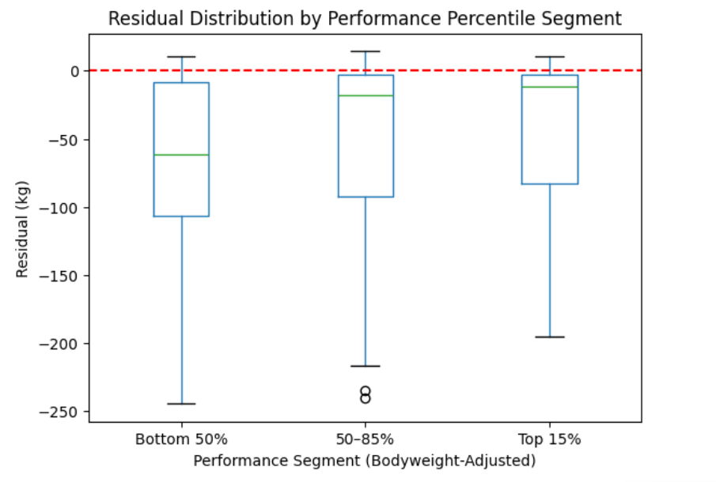

# USA Olympic Weightlifting Data - Scrape and Performance Analysis

## Overview

This project builds an end-to-end system that:

1. Scrapes all competition results from the USAW athlete portal using Playwright
2. Stores the data in a Supabase PostgreSQL database with deduplication logic, and a CSV file
3. Engineers 25+ features per competition entry to capture athlete trajectory, lift consistency, and competition history
4. Models athlete performance using Linear Regression, Random Forest, XGBoost, and a Neural Network
5. Evaluates each model through segmented analysis broken down by performance percentile within weight class to determine any imbalances

## Data Collection — `meet_scraper.py`

### Implementation
This scraper uses Playwright to automate a headless Chromium browser, log into the USAW athlete portal, then navigates to every meet result page across all specified dates.

It:
- Handles USAW's multi-factor authentication, awaits user input
- Paginates through both meet listings and per-meet athlete result tables
- Scrapes 17 fields per row: meet name, date, athlete name, bodyweight, all six lift attempts, best snatch, best C&J, total, and weight class
- Deduplicates on `(Meet, Name, Bodyweight)` before upserting to Supabase and creating the CSV
- Wraps the full run in a retry loop (up to 5 retries before failure) to handle any network flakiness

### Tech stack
`playwright`, `pandas`, `supabase-py`

## About the Data
All data is sourced from USA Weightlifting's result portal, which tracks every USAW sanctioned competiton result since 2012.

- Total entries: 282,000
- Fields: Meet name, date, athlete name, bodyweight, snatch attempts (3), clean & jerk attempts (3), best snatch, best C&J, total, weight category, gender, age group

Note: Athletes are only able to be identified by name in this current scraping format, as it contains no unique IDs. Thus, athletes with unique names are grouped together, which is a known limitation. This should not affect general trends found by models.

## Analysis — `EDA.ipynb`

### Data Cleaning

- Removes physiologically impossible outliers (e.g. totals > 5.5 x bodyweight)
- Corrected a known data entry error for one athlete by cross-referencing surrounding meets
- Converted missed lifts (sometimes stored as negatives or zeroes in source data) to `NaN` while preserving miss flags, in case they are useful in modeling
- Removed bomb-outs — as this would heavily impact the models performance (noted limitation)

### Feature Engineering

25+ features engineered per competition entry, all using only data available before the current meet to prevent data leakage:

| Category | Features |
|---|---|
| Lift consistency | Per-attempt miss flags, cumulative athlete miss rate by attempt |
| Historical bests | Best snatch to date, best C&J to date, best total to date |
| Trajectory | 3-comp rolling trend (slope), acceleration of improvement, improvement streak |
| Lift balance | Snatch-to-C&J ratio, per-lift improvement rates over last 3 comps |
| Competition history | Number of competitions, days since last comp, comp frequency (last 180 days), comp timing deviation |

### Visualizations
- Total vs. bodyweight scatterplot by gender
- Bodyweight and total distributions by gender
- 31-feature correlation heatmap
- Competition entries by year
- Bodyweight vs. total with 50th and 85th percentile curves overlaid by weight class

### Segmented Analysis
Athletes are separated into current (2025) IWF weight categories, then segmented into performance percentiles within their class

| Segment | Size |
|---|---|
| Low (<50th percentile) | 135,710 entries |
| Mid (50th–85th) | 95,155 entries |
| High (85th–100th) | 40,697 entries |

A utility function `get_performance_percentile(bodyweight, total, gender)` calculates any lifter's percentile rank relative to the full historical dataset within their weight class.

### Models
Four regression models trained on pre-2024 data, evaluated on 2024+ data:
 
| Model | MAE (kg) | RMSE (kg) | R² |
|---|---|---|---|
| Linear Regression | 16.58 | 24.06 | 0.853 |
| Random Forest | 10.61 | 17.92 | 0.919 |
| XGBoost (baseline) | 10.19 | 17.58 | 0.922 |
| XGBoost (tuned) | 10.04 | 17.47 | 0.923 |
| Neural Network | 10.82 | 17.88 | 0.919 |

Hyperparameter tuning for XGBoost was done used `RandomizedSearchCV` with 5-fold cross-validation across depth, learning rate, and estimator count. The neural network used a 4-layer MLP with BatchNormalization, Dropout, EarlyStopping, and ReduceLROnPlateau callbacks.

#### Key Finding

Segmented evaluation revealed significant heteroskedasticity — MAE shrinks at higher performance percentiles. Elite athletes are more predictable because they have richer feature histories and more stable performance trajectories. The neural network performed comparably in aggregate but broke down under segmented evaluation, exposing the risk of unbounded outputs on structured tabular data. XGBoost was selected as the best model overall.

## Overall Key Findings

- **Last comp total to date** was the strongest predictors of current total (correlation: 0.98)
- **XGBoost outperformed all models** with a test MAE of 10.04kg and R² of 0.923
- **Prediction accuracy improves with competition history** — athletes with more meets were significantly easier to predict than first-time competitors, confirming that feature engineering compounds with experience
- **Miss rates differ meaningfully by attempt** — first-attempt clean and jerk misses were rarest (10.3%), third-attempt clean and jerk misses most common (43.8%), consistent with competitive attempt selection strategy
- **Elite athletes miss more** — top 15th percentile athletes missed at 29.5% (Snatch) and 32.2% (Clean&Jerk) vs 25.6% and 23.9% (Snatch, Clean&Jerk respectively) for bottom 50th percentile

## Error Analysis
 
**Residuals by Performance Segment (Tuned XGBoost)**
 

 
- The model's error shrinks significantly at higher performance percentiles, confirming the heteroskedasticity identified in segmented evaluation
- Lower percentile athletes show wider residual spread, consistent with sparser feature histories and more variable performance

## Limitations

- Athletes are identified by name only — no unique athlete ID exists in the source data, so athletes with identical names are grouped together
- Age is not available from meet-level scraping
- No access to training data, injury history, or competition strategy
- Feature engineering is biased toward athletes with longer competition histories — newer athletes have sparse or null values for trajectory features
- Bomb-outs (athletes who totaled zero) were excluded and not modeled
- Some weight classes are better represented than others, which may affect percentile accuracy in smaller classes

## Future Work

- Refactor code to auto-update CSV file, instead of database. This would also include implementing GitHub Actions
- Scrape by athlete profile, to gain unique ID's, region, and age, which could lead to many more insights and possibly improved models
- Model probability of "bomb-outs" separately
- Focus modeling on higher percentile of lifters, where it can be more useful
- Host visualizations for coaches and athletes (coming soon)

## Setup
```bash
git clone https://github.com/0Davos/USA_Olympic_Weightlifting_Scrape_and_Analysis.git
pip install -r requirements.txt
playwright install chromium
```
 
Create a `.env` file in the root directory:
```
SUPABASE_URL=your_url
SUPABASE_KEY=your_key
USAW_EMAIL=your_usaw_email
USAW_PASSWORD=your_usaw_password
```
 
Run the scraper:
```bash
python meet_scraper.py
```
 
To open the analysis notebook:
```bash
jupyter notebook
```
Then move into the EDA folder.

### Optional
To run Neural Network cell, requires python 3.11 or earlier
```bash
pip install tensorflow
```
Then uncomment all lines related to the neural network.

